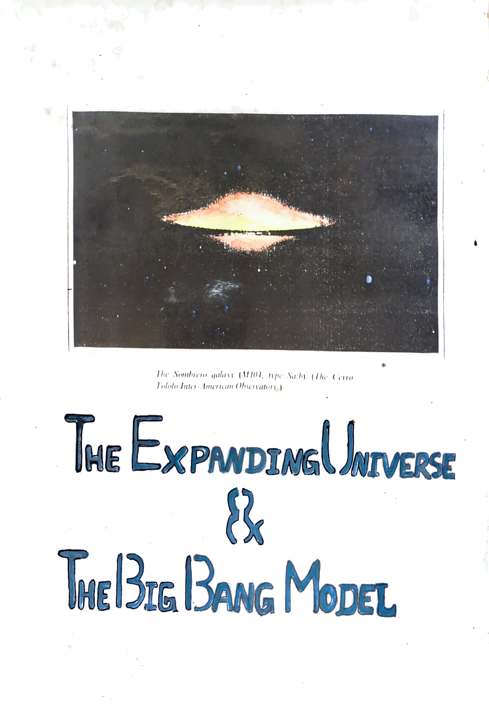

# The Expanding Universe & The Big Bang Model

**B.Sc Physics Project Report, 1998**

**Author: Alex C Punnen**

---

## Contents

### Part I: The Expanding Universe

1. [Methods in Observational Astronomy (Optical Telescopes)](chapters/ch01-methods-observational-astronomy.md)
2. [Estimating the Distance Scale of the Universe](chapters/ch02-distance-scale.md)
   - a. Trigonometric Parallax Method
   - b. H-R Diagram
   - b1. H-R Diagram of Nearby Star Clusters, Main Sequence Fitting
   - c. H-R Diagram Used in Determining Distances
   - c1. Distance to the Hyades Cluster - Moving Cluster Method
   - d. Cepheids as Distance Indicators
3. [Expansion of the Universe](chapters/ch03-expansion-of-universe.md)
   - a. The Hubble's Law
   - b. The Implications of Hubble's Law
   - b1. The Age of the Universe
   - b2. Determination of the Large Scale Structure of the Universe

### Part II: The Big Bang Model of the Origin of the Universe

1. [Distribution of Radio Galaxies and Quasars](chapters/ch04-radio-galaxies-quasars.md)
2. [Olbers' Paradox and Its Resolution](chapters/ch05-olbers-paradox.md)
3. [The Prediction of Cosmic Background Radiation](chapters/ch06-prediction-cosmic-background.md)
4. [The Discovery of Cosmic Microwave Background Radiation](chapters/ch07-discovery-cmb.md)
5. [The Hot Big Bang](chapters/ch08-hot-big-bang.md)
6. [Big Bang Nucleosynthesis (He Abundance - Confirmation of Big Bang Theory)](chapters/ch09-big-bang-nucleosynthesis.md)
7. [Conclusion](chapters/ch10-conclusion.md)
8. [References](chapters/references.md)

---

*Originally submitted as a B.Sc Physics Project Report, 1998*
