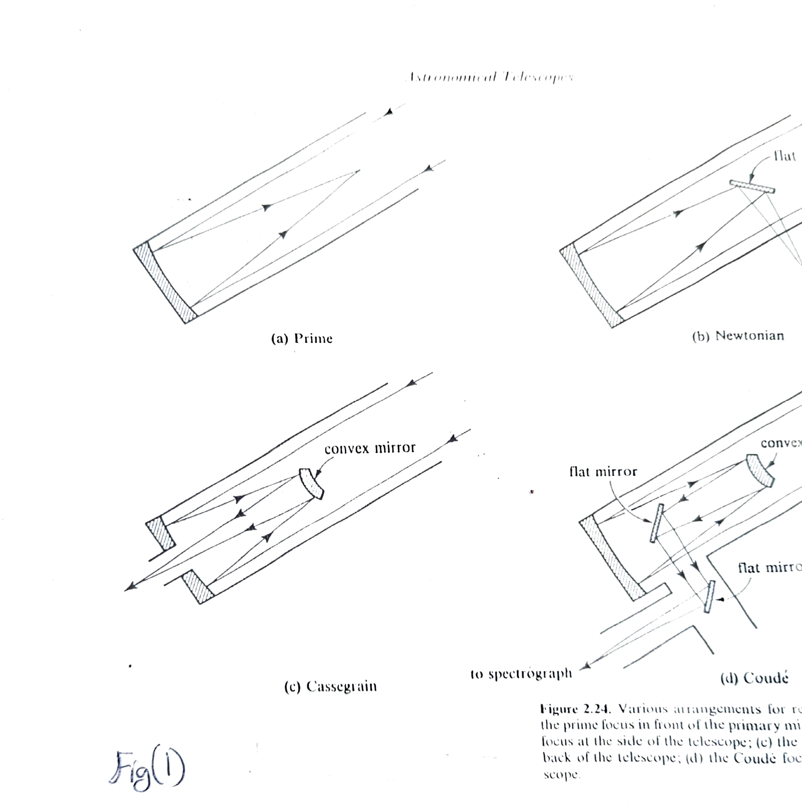
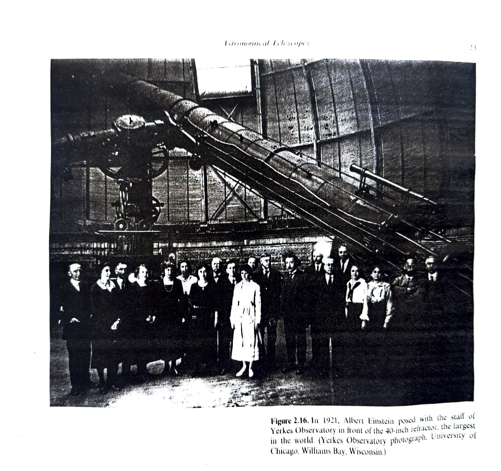

# Chapter 1: Methods in Observational Astronomy

## Astronomical Telescopes

Astronomical telescopes can be constructed which use either refraction or reflection to gather light over a large collecting surface and focus it on a much smaller area. This property of gathering more light, and not magnification, is the primary purpose of most astronomical telescopes.

Though there are two types of telescopes, refracting and reflecting, the most widely used are the reflecting telescopes. Refracting telescopes are not widely used because of their many drawbacks like chromatic aberration, limitation in the design and setting up of lens systems etc. So we shall see about reflecting telescopes here.

### Reflecting Telescopes

The main element in reflecting telescopes is a parabolic mirror which brings all light from a point source to a focus at a single point. Since secondary mirrors can be easily used to deflect a light beam, a variety of possible foci can be arranged, with different focal ratios, so that a single telescope can be used equally efficiently for several different purposes. The various foci in common use are shown in Fig(1).

*Figure 2.24. Various arrangements for reflecting telescopes: (a) the prime focus in front of the primary mirror; (b) the Newtonian focus at the side of the telescope; (c) the Cassegrain focus at the back of the telescope; (d) the Coude focus alongside the telescope.*

*Figure 2.16. In 1921, Albert Einstein posed with the staff of Yerkes Observatory in front of the 40-inch refractor, the largest in the world. (Yerkes Observatory photograph, University of Chicago, Williams Bay, Wisconsin.)*
