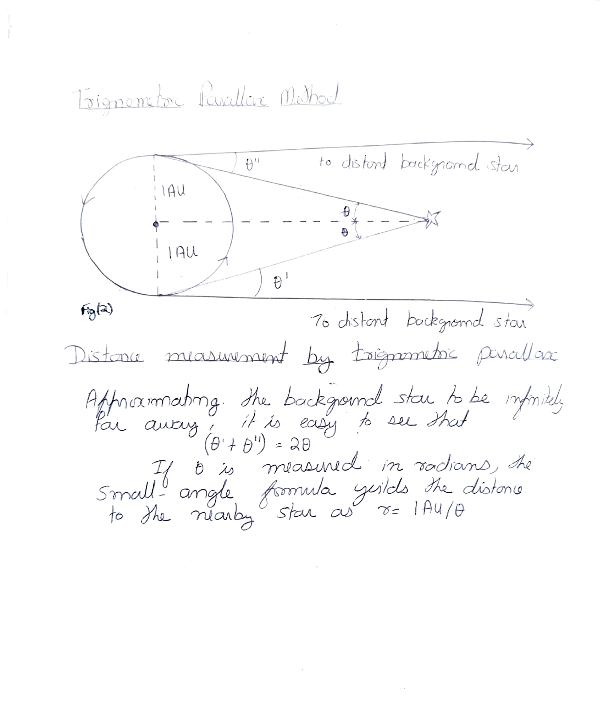
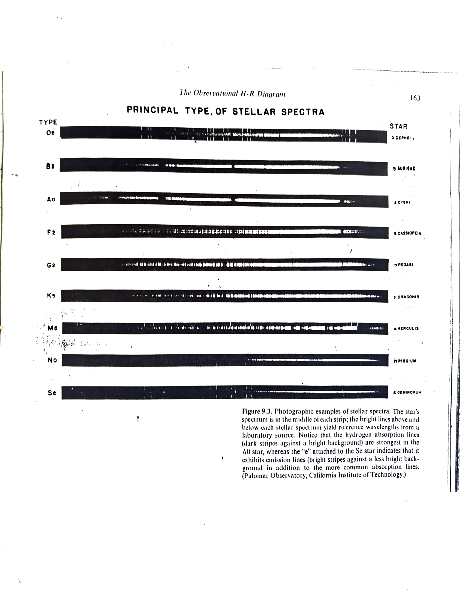
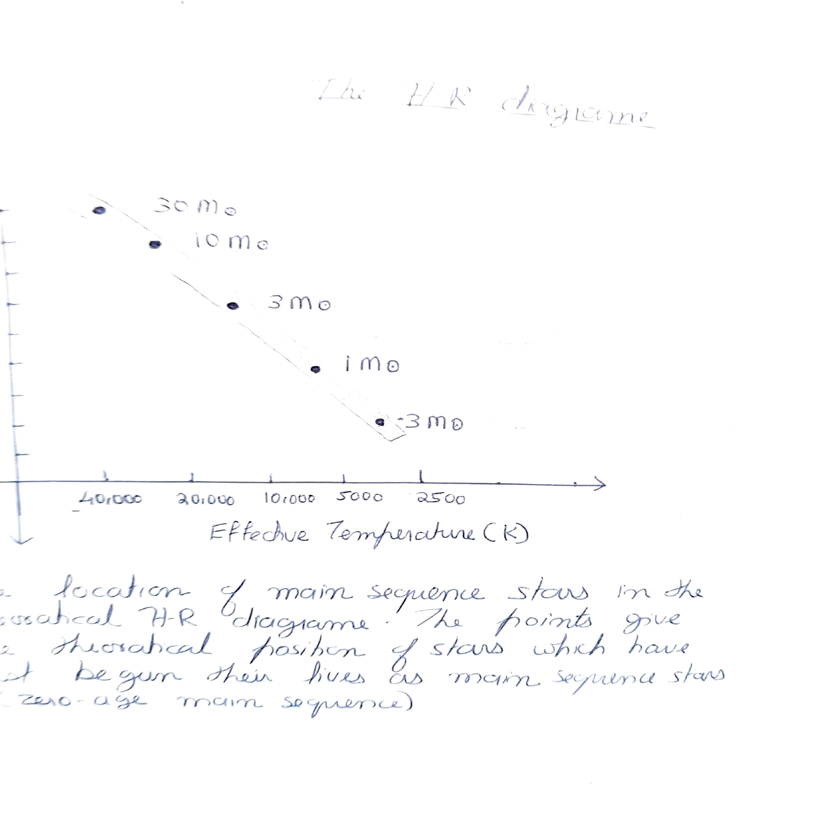
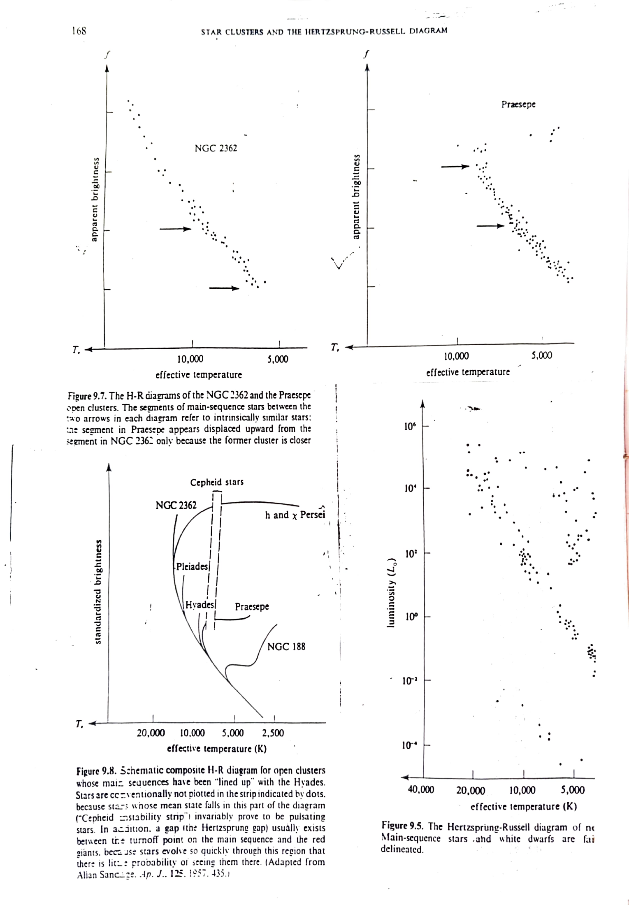
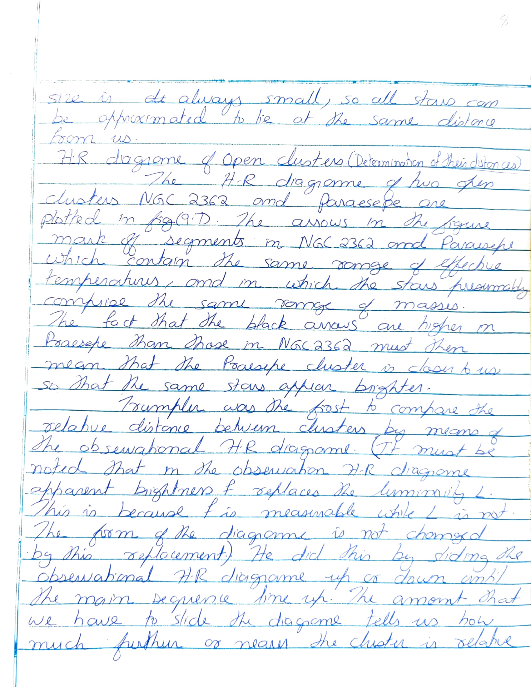
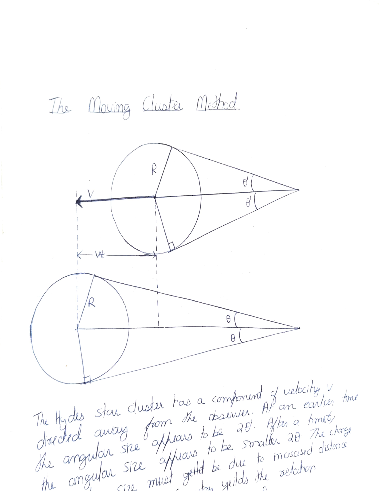
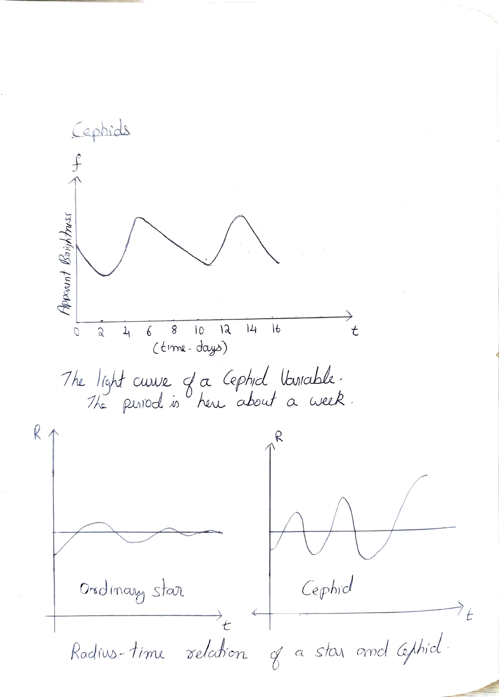
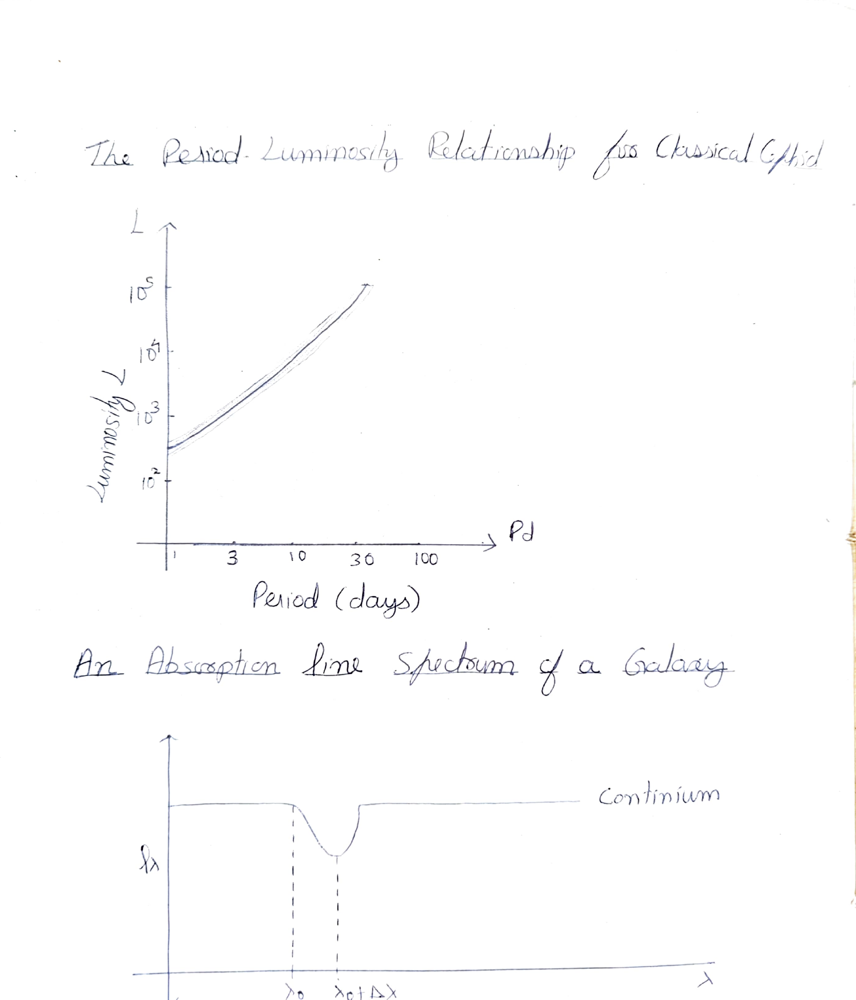

# Chapter 2: Estimating the Distance Scale of the Universe

## 2a. Trigonometric Parallax Method

This was the earliest method used to gauge the distance of nearby stars. During six months of the Earth's motion about the Sun, a nearby star is observed to shift its apparent angular position with respect to distant background stars. In the example shown in Fig(2) it is first observed to lie at an angle &theta;' to the left of a distant background star; six months later it is seen at an angle &theta;" to the right of the distant background star.

*Figure 2: Distance measurement by trigonometric parallax. The Earth's orbit (radius 1 AU) provides the baseline.*

Approximating the background star to be infinitely far away, simple geometry gives the distance to the star as:

> **d = 1 AU / &theta;**

where (&theta;' + &theta;") = 2&theta;

If &theta; is measured in radians, the small-angle formula yields the distance to the nearby star as d = 1AU/&theta;. The angle &theta; is called the parallax of the star. Stars up to 300 light years away can have their distance determined by this method.

## 2b. The Hertzsprung-Russell Diagram

Many properties of stars, even their distance, can be determined in terms of the location of a star in the H-R diagram.

The H-R diagram is a plot of the Luminosity (L) of a star versus its effective temperature (Te). Let's first see how L and Te are determined.

### Luminosity (L)

To obtain the luminosity of a star we need to make two measurements:

**(a)** We need to measure the apparent brightness 'f' of a star, which is the total energy received from the star/unit time/unit area at the Earth.

**(b)** We need the distance 'd' of the star away from us. For nearby stars and star clusters, distance can be calculated by parallax method or moving cluster method.

Then: **L = f &middot; 4&pi;d&sup2;**

### Effective Temperature

There are two independent methods for measuring Te. They are:

#### (i) UBV Color Photometry

The basic idea behind this is to measure the proportions of radiant energy put out by a thermal body at ultraviolet (U), blue (B), and visual (V) wavelengths. These proportions depend on the surface temperature of the opaque body; the hotter the body, the greater the body's proportion of shorter wavelengths.

If f(U), f(B) and f(V) are the apparent brightness of a star at U, B and V wavelengths respectively, then:

> f(V)/f(B) = function of Te
>
> f(B)/f(U) = function of Te

#### (ii) Spectral Classification

The basic idea behind spectral classification is that for a given chemical composition, the pattern of absorption lines which are formed in the photosphere of a star depend on the temperatures which exist in the photosphere. Thus to a first approximation, the spectral type of a star yields an estimate of its effective temperature.

> Spectral type = function of Te

*Figure 9.3. Photographic examples of stellar spectra. The star's spectrum is in the middle of each strip. (Palomar Observatory, California Institute of Technology.)*

### The H-R Diagram: Main Sequence

*The location of main sequence stars in the theoretical H-R diagram. Points show the theoretical position of stars which have just begun their lives as main sequence stars (zero-age main sequence). Effective temperature (K) on x-axis; masses shown in solar masses (M&#9737;).*

## 2b1. The H-R Diagram of Star Clusters and Main Sequence Fitting

*(H-R diagram used in determining distances)*

Observationally, astronomers have found two different kinds of star clusters in the galaxy, i.e. the open clusters and the globular clusters. A cluster's angular size is always small, so all stars can be approximated to lie at the same distance from us.

### H-R Diagram of Open Clusters (Determination of their distances)

The H-R diagrams of two open clusters NGC 2362 and Praesepe are plotted in Fig(9.7). The arrows in the figure mark segments in NGC 2362 and Praesepe which contain the same range of effective temperatures, and in which the stars presumably comprise the same range of masses. The fact that the black arrows are higher in Praesepe than those in NGC 2362 must then mean that the Praesepe cluster is closer to us, so that the same stars appear brighter.

*Figure 9.7 (top): H-R diagrams of NGC 2362 and Praesepe open clusters. Figure 9.8 (bottom-left): Schematic composite H-R diagram for open clusters lined up with the Hyades. Figure 9.5 (bottom-right): The Hertzsprung-Russell diagram of nearby main-sequence stars and white dwarfs.*

Trumpler was the first to compare the relative distance between clusters by means of the observational H-R diagram. He did this by sliding the observational H-R diagram up or down until the main sequences line up. The amount that we have to slide the diagram tells us how much further or nearer the cluster is relative to some standard.

If we can deduce the distance to the Hyades cluster, we can deduce the distance to all other open clusters in the diagram from the amount that we have to slide them up to make their main sequence line up with that of Hyades.

### Main Sequence Fitting

Theoretical models show that all unevolved stars of the same chemical composition have the same locus in the colour-magnitude diagram: The Zero Age Main Sequence (ZAMS). For most clusters we observe only (mv, B-V) and obtain the shape of the main sequence. For the Hyades we know (Mv, B-V), and we can determine the distance modulus mv-Mv for each cluster by fitting its ZAMS to that of the Hyades. The vertical shift needed at a given B-V to fit the two ZAMS's together is just the distance modulus of the cluster.

*Main Sequence Fitting: The difference between apparent (mv) and absolute (Mv) magnitudes at a given colour is independent of colour and is the distance modulus of the cluster. (In this case it is 13-4 = 9)*

## 2c. Distance to the Hyades Cluster - Moving Cluster Method

The Hyades cluster happens to be close enough to us and happens to be moving with a component of velocity directed away from our line of sight that it has a deducible change of angular size with time. These facts allow the distance to Hyades to be calculated by what is called "the moving cluster method".

*The Hyades star cluster has a component of velocity V directed away from the observer. At an earlier time the angular size appears to be 2&theta;'. After a time t, the angular size appears to be smaller 2&theta;. The change in angular size yields the distance.*

## 2d. Cepheids as Distance Indicators

For star clusters that are too far away to allow astronomers to measure the properties of their relatively faint main-sequence stars, there is another way to discover their distances by the use of Cepheid variable stars.

In many star clusters are found stars which vary in total light output (luminosity) in a periodic fashion. Such stars are called variable stars, the most famous of them being the stars called Cepheids. The luminosity (L) of the Cepheids are directly proportional to their pulsation period (P), i.e. **L &prop; P**.

*Top: The light curve of a Cepheid variable — the period is here about a week. Bottom: Radius-time relation comparing an ordinary star (left) and a Cepheid (right).*

But we have **L = f &middot; 4&pi;d&sup2;** where f is the apparent brightness and d is the distance of the star from us. Since the apparent brightness of the Cepheids can be easily determined, we can calculate their distance from us by the relation **L = KP = f &middot; 4&pi;d&sup2;**, where K is a constant of proportionality.

There are a small number of open clusters that contain Cepheids and we can use main-sequence fitting method to find their distances. With this data, the Cepheid period-luminosity relationship can be calibrated and the constant of proportionality found out. The P-L relation of Cepheids provided the major method by which astronomers extended the distance scale beyond the nearby open clusters.

*Top: The Period-Luminosity relationship for Classical Cepheids — luminosity L (in solar units) vs period Pd (days). Bottom: An absorption line spectrum of a galaxy showing the continuum, absorption line at &lambda;0, and redshift &Delta;&lambda;.*
