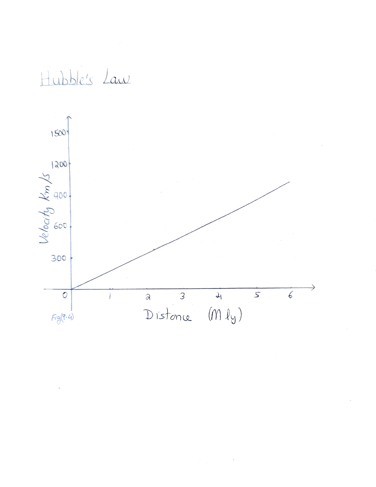
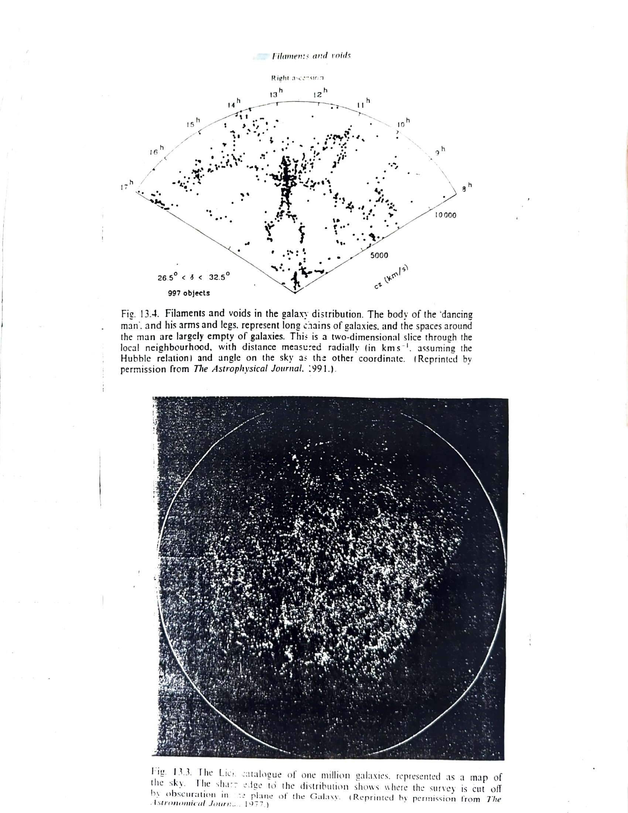

# Chapter 3: Expansion of the Universe

Our present understanding of the nature of galaxies started with the work of Hubble in 1920's. He was the first to discover Cepheid variables in the Andromeda galaxy M31 and other galaxies and thus establish their distances. Using the 100-inch telescope at Mount Wilson, Hubble went on to study the spectra of galaxies. He found that except for a few nearby galaxies, the spectral lines of all galaxies showed a shift towards the red end of the spectrum (a redshift). Moreover, the more distant galaxies (judged by their faintness) showed the largest redshift. The most natural explanation of this was the Doppler effect - the galaxies were moving away from us, and the most distant (actually the farthest members of a cluster) were receding fastest at 1200 km/s.

## 3a. Hubble's Law

Hubble plotted a graph with distance against redshift velocities of galaxies and he got a straight line. See Fig(9.4). That is, redshift velocity was directly proportional to the distance of the galaxy. This relation between velocity (V) and distance R:

> **V = H&#8320;R**

is called the "Hubble's Law" and the constant of proportionality is called the Hubble constant.

*Fig(9.4): Hubble's Law - the linear relationship between recession velocity (km/s) and distance (Mly)*

## 3b. The Implications of Hubble's Law

Hubble had been reluctant to draw such a grand conclusion from his flimsy data. For one, the redshifts might not be classic Doppler shifts at all. Moreover there were perhaps 100 billion galaxies in the sky and so far the expansion was based on less than 200 of them. Nevertheless the Hubble's law was widely accepted. In 1933 Humason had measured a cluster of galaxies in constellation Ursa Major. The Hubble's law still held at that distance.

## 3b1. The Age of the Universe

The expansion of the Universe has an implication that at some time in the past, all the matter in the Universe must have been extremely closely packed. This thought was the seed of the Big Bang theory and that the Universe had a beginning in time.

The distance from us (R) that any given galaxy has travelled during its lifetime (t&#8320;) is equal to velocity times lifetime:

> R = Vt&#8320;

Now by Hubble's law V = H&#8320;R:

> R = H&#8320;Rt&#8320;
>
> t&#8320; = 1/H&#8320;

That is, the quantity **1/H&#8320;** is a measure of the "expansion age" of the Universe.

## 3b2. Determination of the Large Scale Structure of the Universe

Because of the simple linear relationship between velocity and distance and the ease with which redshifts can be measured, redshift is now used as a measure of distance for galaxies at large distance (>200 Mpc). With the advent of fibre optic spectrographs more than a hundred galaxy redshifts can be measured in a single exposure. This has transformed our view of the Universe, allowing the three dimensional structure of the Universe on a large scale to be probed for the first time.

*Fig. 13.4. Filaments and voids in the galaxy distribution. The body of the 'dancing man', and his arms and legs, represent long chains of galaxies, and the spaces around the man are largely empty of galaxies. Fig. 13.3. The Lick catalogue of one million galaxies, represented as a map of the sky.*
