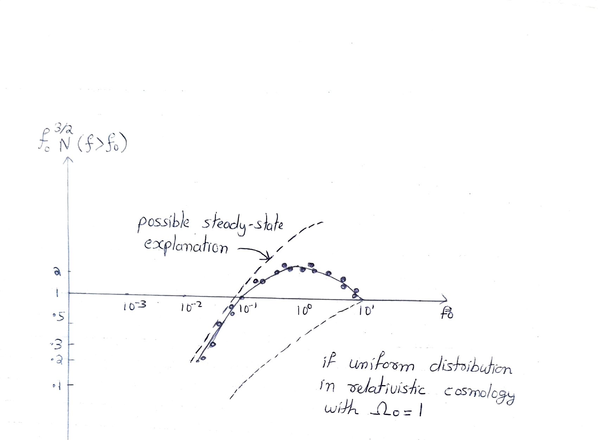

# Chapter 4: Distribution of Radio Galaxies and Quasars

## Part II: The Big Bang Model of the Origin of the Universe

The first piece of evidence in favour of the Big Bang model concerned the spatial distribution of strong radio galaxies. Counts of these sources by Ryle and his colleagues revealed that there were more radio galaxies at far distances from us than near distances. Now when we look at very distant objects, we are looking at events from the remote past. The excess of strong radio galaxies in the remote past must mean that the conditions in the past were different from what they are today. An excess of far sources would be a global property of the Universe and would therefore contradict the basic tenet of the steady-state theory.

*Radio source counts plotted as f&#8320;^(3/2) N(f > f&#8320;). The data points show the observed distribution. The dashed curve shows what a possible steady-state explanation would predict. The lower dashed line shows what a uniform distribution in relativistic cosmology with &Omega;&#8320; = 1 would predict. The observed excess of faint (distant) sources contradicts the steady-state model.*
