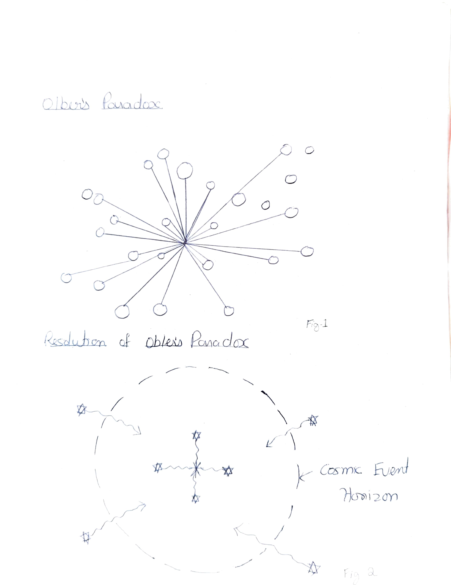

# Chapter 5: Olbers' Paradox and Its Resolution

In a Euclidean Universe uniformly and statically filled with stars, on average every line of sight will eventually intercept the surface of a star and the night sky would be as bright as the surface of an average star. See Fig(1). (This has an analogy to being in the midst of a forest and everywhere around you, you see a wall of trees.)

*Fig 1: Olbers' Paradox - In a uniform infinite universe, every line of sight ends on a star. Fig 2: Resolution - The Cosmic Event Horizon limits the observable universe.*

As E.R. Harrison has emphasized, in conventional cosmologies there are logically two independent ways out of this dilemma:

**(a)** Expansion of the Universe, and

**(b)** A finite age for the Universe.

Expansion helps because the cosmological redshift prevents distant stars from making simple Euclidean contributions to the night-sky brightness. But most important is the assumption of the finite age of the Universe, because the light from very distant stars then simply does not have time to get here, even if we ignore redshift (see Fig 2). In the steady state, only the expansion argument is available. In Big Bang theory, cosmological expansion and a finite age of the Universe go hand in hand.
