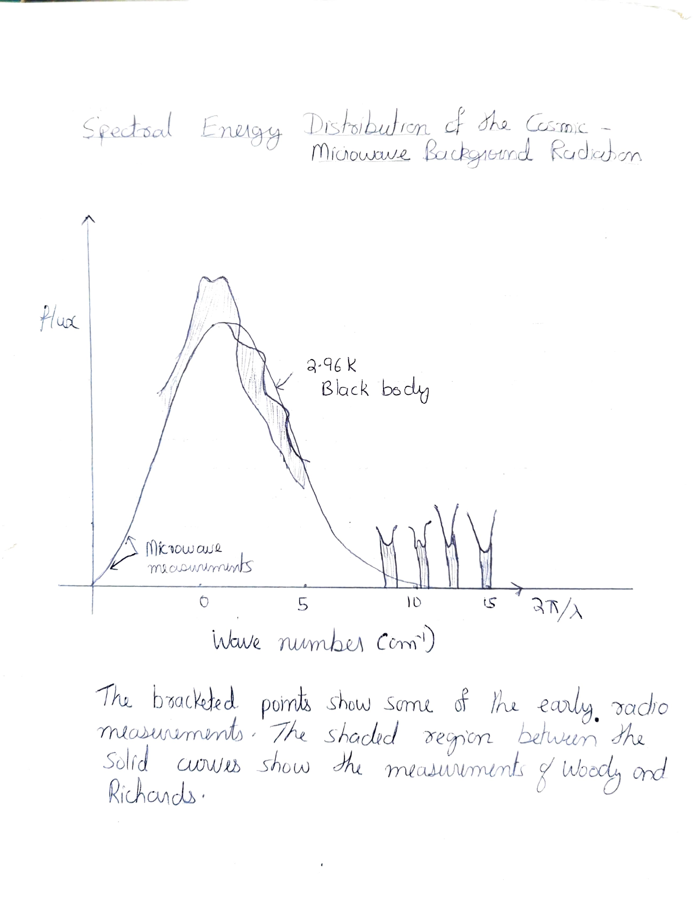
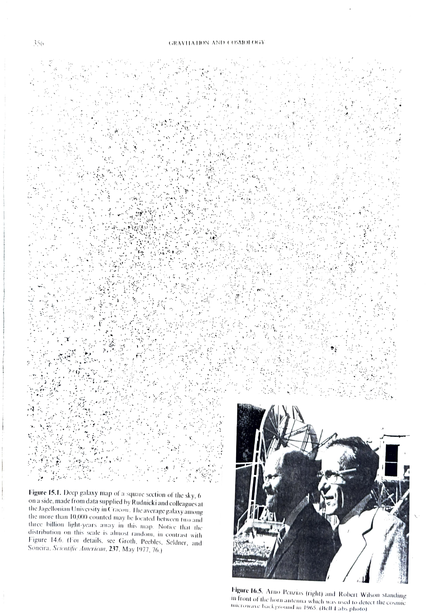

# Chapter 7: The Discovery of Cosmic Microwave Background Radiation

It was at this time that two Bell Lab scientists, Arno Penzias and Robert Wilson, were calibrating a small radio horn designed for satellite communication. They became deeply puzzled by the ubiquitous presence of excess noise in their sources even after they had eliminated all noise sources. This seemed to be distributed throughout the sky in an isotropic fashion.

When they consulted Bernard Burke of MIT of this problem, Burke realized that Penzias and Wilson had probably found the cosmic background radiation that Dickie and his colleagues were planning to measure. Put into touch with each other, the two groups subsequently published simultaneous papers detailing the prediction and discovery of a universal thermal radiation field with a temperature of about 3K.

The discovery of cosmic microwave background radiation was a direct prediction of the Big Bang theory and effectively sounded the death knell for the steady state viewpoint.

*Spectral Energy Distribution of the Cosmic Microwave Background Radiation. The curve shows a 2.96K black body spectrum. The bracketed points show some of the early radio measurements. The shaded region between the solid curves shows the measurements of Woody and Richards.*

*Figure 15.1 (left): Deep galaxy map of a square section of the sky, 6° on a side, made from data supplied by Rudnicki and colleagues at the Jagellonian University in Cracow. Figure 16.5 (right): Arno Penzias (right) and Robert Wilson standing in front of the horn antenna used to detect the cosmic microwave background in 1965. (Bell Labs photo)*
