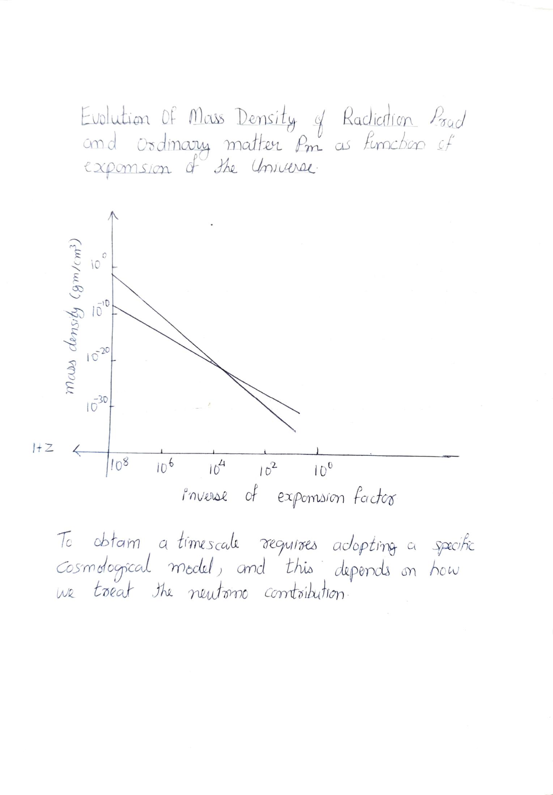
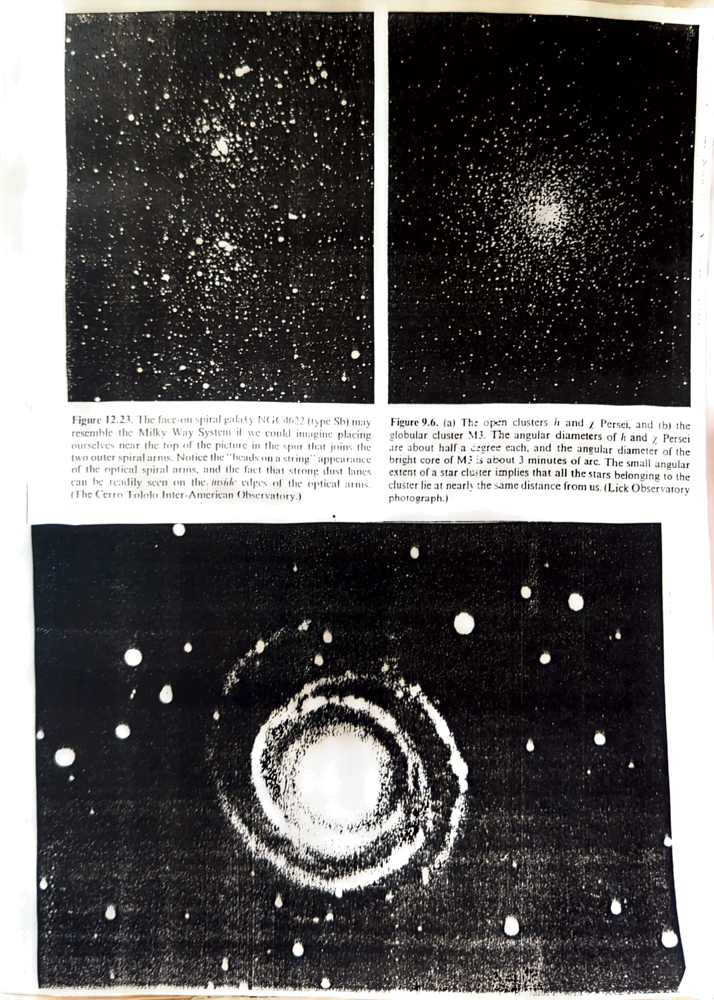

# Chapter 8: The Hot Big Bang

We shall now discuss the theoretical implications of the Penzias-Wilson discovery. Since the wavelength &lambda;max of peak thermal emission varies with the radiation temperature T_rad in accordance with Wien's displacement law:

> **&lambda;max &times; T_rad = a constant**

and since this peak wavelength must stretch with the expansion of the Universe in accordance with the redshift formulae:

> **&lambda;max &prop; D(t)**

where D(t) is the scale factor of the Universe, then the radiation temperature T_rad must decrease as the Universe expands according to:

> **T_rad &prop; D&#8315;&sup1;**

Thus in the past when D was smaller, the density of the thermal radiation field must have been larger:

> **&rho;_rad &prop; D&#8315;&#8308;**

In contrast, the matter density in the past would have been higher only according to:

> **&rho;_m &prop; D&#8315;&sup3;**

The ratio &rho;_rad/&rho;_m &prop; D&#8315;&sup1;. The current ratio approximately equals 10&#8315;&sup3; if we include only the matter seen in galaxies to calculate &rho;_m. Thus at present matter dominates radiation. But at a redshift of about 10&sup3;, and the Universe was a 1000 times smaller than it is now, the mass density of matter and radiation would have been equal. Before that the Universe would have been radiation dominated.

*Evolution of mass density of radiation (&rho;_rad) and ordinary matter (&rho;_m) as a function of the inverse expansion factor (1+z). To obtain a timescale requires adopting a specific cosmological model, and this depends on how we treat the neutrino contribution.*

Summarizing: if we go backwards in time, the radiation density and the matter density both increase, but the radiation density increases faster than matter density. Thus in the beginning, radiation might have dominated over the ordinary forms of matter. The early Universe must have been exceedingly bright. That is, according to the Big Bang theory, the Universe had a beginning — it began with all the matter of the Universe in a primordial high-density state which exploded in a big bang. From that instant on the Universe expanded. As the galaxies formed they too shared in the expansion.

*Figure 12.23: The face-on spiral galaxy NGC 4622 (type Sb). Figure 9.6(a): The open clusters h and &chi; Persei. Figure 9.6(b): The globular cluster M3. The angular diameter of the bright core of M3 is about 3 minutes of arc.*
