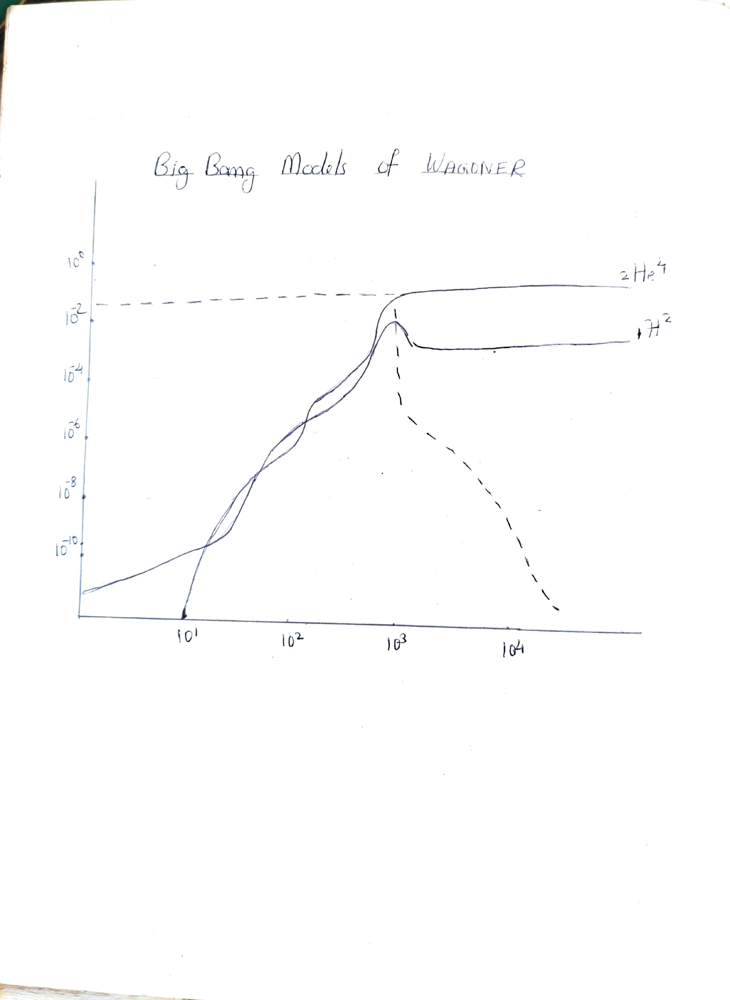
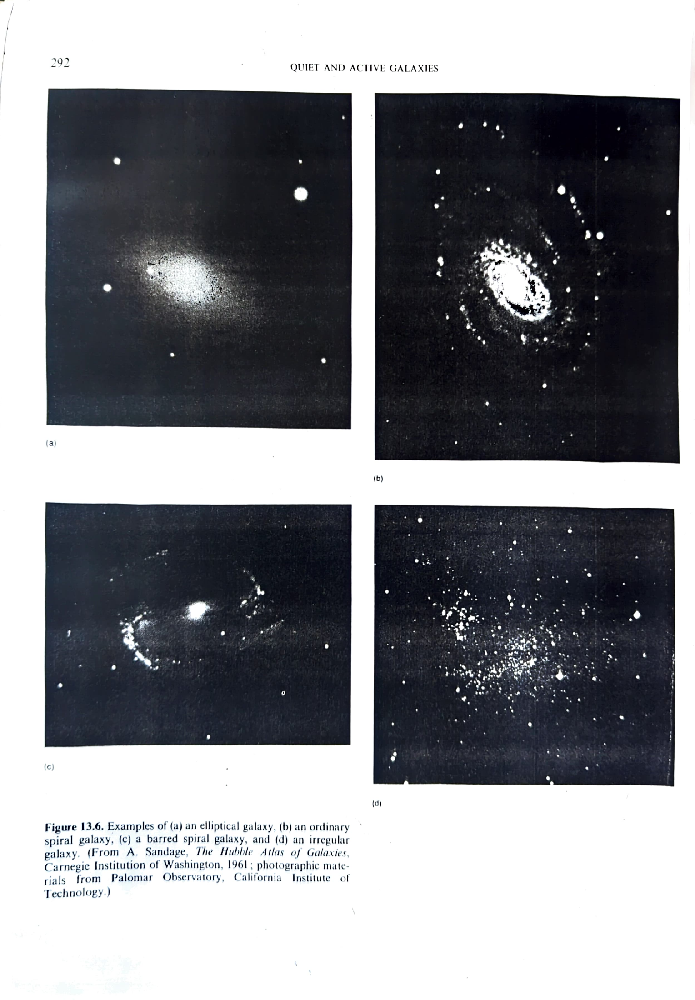
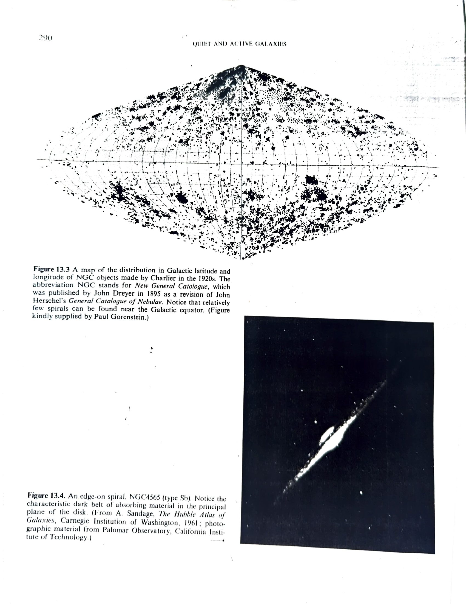

# Chapter 9: Big Bang Nucleosynthesis

*(He Abundance — Confirmation of Big Bang Theory)*

At a temperature in excess of 10&sup1;&sup2; K (t less than 10&#8315;&sup2; s), the creation and annihilation of baryon/antibaryon pairs could have been in thermodynamic equilibrium with the ambient radiation field. Because of the slight asymmetry of baryons and antibaryons, there would be a residue of protons and neutrons left without partners to annihilate when temperature drops significantly below 10&sup1;&sup2; K.

The residual baryons are kept in thermal equilibrium by the presence of an enormous sea of elementary particles via the reactions:

> p + e&#8315; &#8652; n + &nu;
>
> p + &nu;&#772; &#8652; n + e&#8314;

When the Universe is tens of seconds old, the neutrinos and antineutrinos will have decoupled from electrons and positrons. The absence of e&#8315; and &nu;&#772; with sufficient energy to drive the reactions in the forward direction means that the free neutrons will want to beta decay:

> n &#8594; p + e&#8315; + &nu;&#772;

However, well before 10 minutes is up, the free neutrons may be captured by free protons to form deuterium nuclei:

> n + p &#8594; &sup2;H + &gamma;

Once deuterium has formed, a rapid sequence of reactions leads mostly to the formation of He-4. Two neutrons and two protons are needed to form a He-4 nucleus.

Now the energy required to make a neutron from a proton must basically be derived from an energetic electron or antineutrino. As long as such particles are around, the relative concentration of neutrons and protons will satisfy the relation:

> **Nn/Np = exp[-(mn - mp)c&sup2;/kT]**

As an application of the equation we can see that there would be roughly one neutron for every five protons at a temperature T = 10&sup1;&#8304; K.

As already stated, two neutrons and two protons are needed to form one He-4 nucleus. Thus if we started with 2 neutrons and 10 protons (1n for every 5p) we would end with one He-4 nucleus and 8 H nuclei (protons). The atomic weight of He-4 is 4, whereas we have a total atomic weight of 2+10 = 12. Thus this simple calculation yields an expected fraction of He-4 by mass of **4/12 = 33%**. More sophisticated analysis yields a He mass fraction close to **25%**.

Observationally, stars are believed to begin their lives with a He mass fraction of 20% to 30%. The reasonable agreement of this range with that predicted by standard Big Bang models is cause for optimism that we are on the right track.

*Big Bang nucleosynthesis models of Wagoner showing the evolution of He-4 (²He⁴) and deuterium (¹H²) abundances as a function of time (seconds). The dashed curve shows ²He⁴ and the solid curves show ¹H² and other light elements.*

*Figure 13.6. Examples of (a) an elliptical galaxy, (b) an ordinary spiral galaxy, (c) a barred spiral galaxy, and (d) an irregular galaxy. (From A. Sandage, The Hubble Atlas of Galaxies, Carnegie Institution of Washington, 1961; Palomar Observatory, California Institute of Technology.)*

*Figure 13.3: A map of the distribution in Galactic latitude and longitude of NGC objects made by Charlier in the 1920s. Notice that relatively few spirals can be found near the Galactic equator. Figure 13.4: An edge-on spiral, NGC 4565 (type Sb), showing the characteristic dark belt of absorbing material in the principal plane of the disk.*
